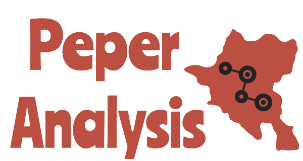

# Peper-Analysis


An intelligent analyzer and visualizer of natural language reviews from [AirBNB](https://www.airbnb.com) and [TripAdvisor](https://www.tripadvisor.com).

## How to install and run the app?
We are using Python and JavaScript as main programming languages, so we will have to setup both sides in order
to run the app.

### Installation
1) Since our back-end is written using `Node.js`, you will need to download it from [here](https://nodejs.org/en/).
2) Once you have `Node.js` you will need to install the packages we used to build this project, specified in `package.json`.
<br>Navigate to the root directory of the project and run the following:
    ```bash
    npm install
    ```
3) Now, that we are done with JavaScript's dependencies, lets continue with Python's.
Of course you will need to download the Python programming language. Click [here](https://www.python.org/ftp/python/3.7.2/python-3.7.2-macosx10.9.pkg) to do so.
4) Now, because we are using virtual environment to manage our dependencies, you will need to download `Pipenv`.
<br> Check out [here](https://pipenv.readthedocs.io/en/latest/install/#installing-pipenv) to understand how to do so.
5) Once you have installed `Pipenv` you are ready to install the requirements.
<br>Navigate to the root directory of the project and run the following:
    ```bash
    pipenv install
    ```
6) Good Job! Now you are all setup to run the app.

### Running
Coming soon...
